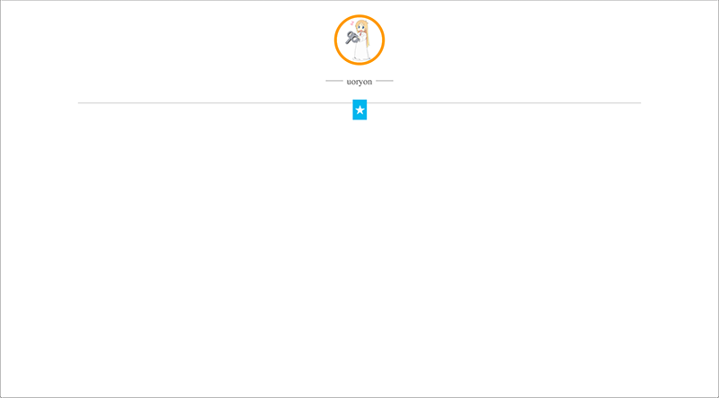
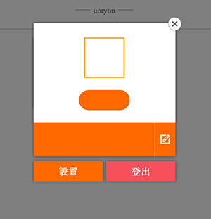
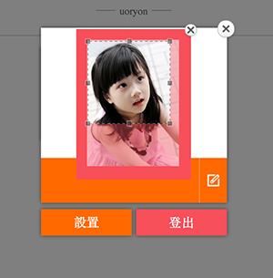
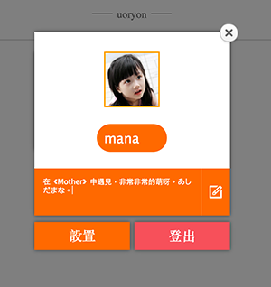
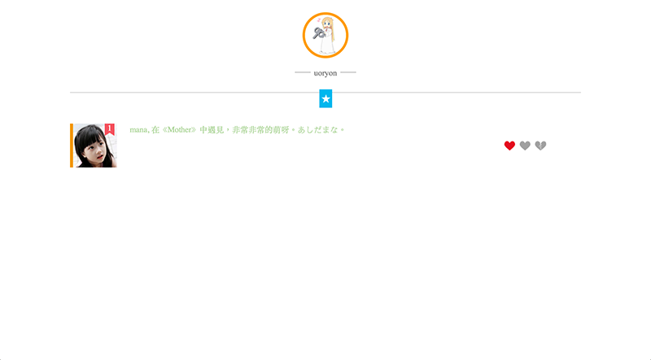
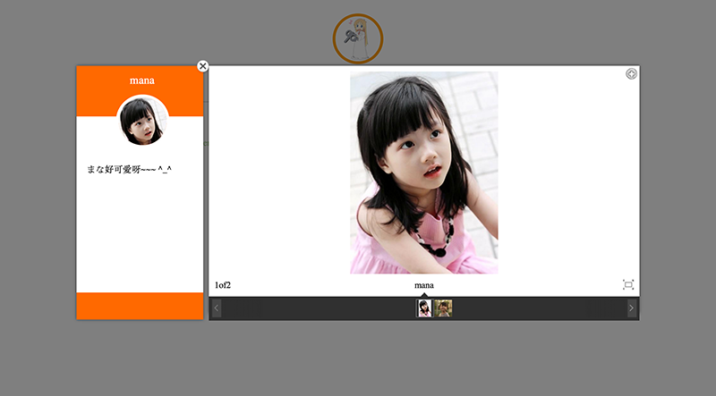

###Grank

這個小玩具。是為了記錄好我們一步一步的腳印，能夠認認真真的面對我們生活中的點點滴滴。


---

####到底是什麼呢

註冊賬號登陸后，就會變成這個樣子。



一眼望去是不是出了頭像什麼都沒有？^_^其實是通過中間那個小五角星來交互的喲~

點擊小星星。



就出現了這樣的東東呀 = =

點擊第一個小矩形，選擇圖片上傳，裁剪區域。



添加描述上傳。



上傳成功后滿滿的小幸福喲~~




當然這樣還沒有完哦。與mana的旅程怎麼能就這樣結束。還能做到這樣，



---

介紹完了，來聊聊這個應用技術方面的。

---

####依賴

```
{
	"express":"3.1.1",
	"jade":"*",
	"mongodb":"*",
	"connect-mongo":"*",
	"canvas":"*",
	"cron":"*"
}
```

當然，通過`npm install`就可以完成了。

她上傳頭像的裁取的時候，使用的是canvas，將圖片轉為 `data uri` 來向後臺傳輸，nodejs再將圖像用canvas畫出來（其實當做字段存入`mongodb`也可以，不過性能上沒有測試，以後會補上兩種方案測試的結果）。